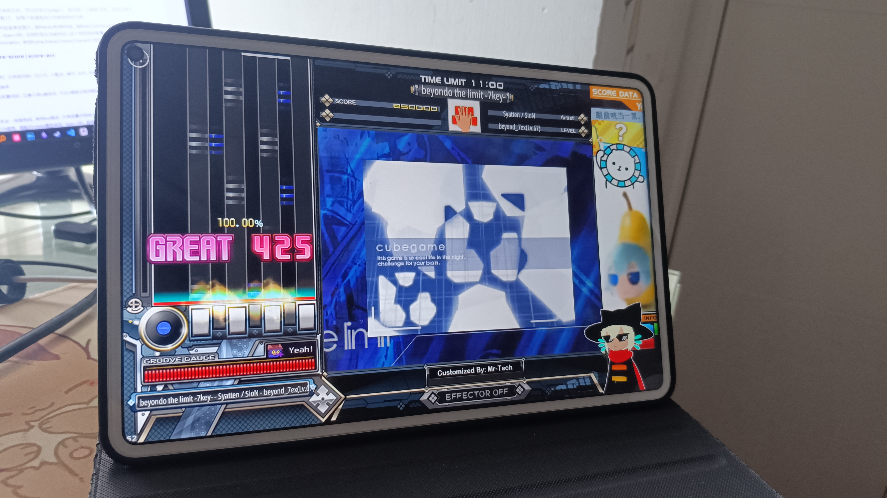
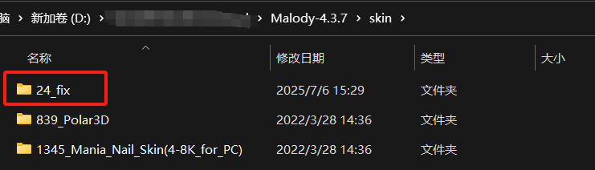

# Malody_IIDX_24_Patched_Skin
A customized skin for Malody reading 7/8K charts. Which supports reading both BGA & BGI(part of). *Originated from "IIDX_24_SINOBUZ"* 
一个Malody的7/8K皮肤, 适配于全端, 支持BGA, 也能看到(部分)BGI曲绘 (如有

移动端bms不再是梦(迫真 
*注: 该皮肤目前只在Malody4.3.7版本中测试能用, Malody V尚不知是否可用...* 
*ps: This skin works under Malody4.3.7, I have not tested for Malody V yet... 
(You may try it out yourself and give me an issue if possibile :3*

## 制作原因 Why I did this?
很少有人会有在Malody里面有玩BMS的需求, 但恰好我就是一个, 而且我个人已经习惯看IIDX的皮肤了, 看不习惯其他的PC轨道皮 -w- 
但在Malody中要找到的**又能看BGA&BGI**的BMS皮肤<u>基本上没有</u>, 好不容易找到一些, 结果发现要么不会读BGA, 要么看不到曲绘背景😡 
于是, dude一气之下, 决定从0开始自己动手爆改, 就有了这个仓库  
The reason is pretty simple: there haven't been any skins that can read both BGA & BGI (if they exist) at the same time. To make the stage scene more dramatic. I decided to make my own one from scratch using the existing resources. 

## 食用方法 Instruction
*7.6 21:00 追加更新:  
Malody官网把可能出于商业原因4.3.7旧版下载地址关停了, 网上也没找到啥好的下载入口, 这里贴出个人整理的两个平台安装包(网盘 or 前往release ver1.1 进行下载)*
 
(出于安全考虑, 请自行扫QR Code进入地址, 请**使用浏览器PC模式请求**) 
 
密码: fe3n 
Tips: 安装包**已集成该皮肤和两首测试曲**, 可无视下面的安装方法

- **方法A**: 直接下载"**24_fix.msz**", 在Malody中自行导入该皮肤文件启用即可  
*(注: 该皮肤不可和其他皮肤重叠使用)* 
**Method One**: Directly download and import **24_fix.msc** to your Malody 4.3.7 
*(Note: This skin works standalone)*

- **方法B**: 下载'modified'文件夹下的"**24_fix.zip**", 手动将解压出来的文件夹放在Malody目录下的/skin文件夹中 
**Method Two**: Download the '**24_fix.zip**' under the folder 'modified'. Extract the zip folder and cut the extracted folder to your Malody skin folder.

Tips: 该仓库同时也整合了3个带BGA的bms曲包,'Sample_charts'文件夹中 
可自行下载至Malody/beatmap下进行游玩测试, bms曲包所有权归原作者所有 
(Some of the sample charts are also included here for your testing. Please note that the original author and artists reserve all Copyrights.)
